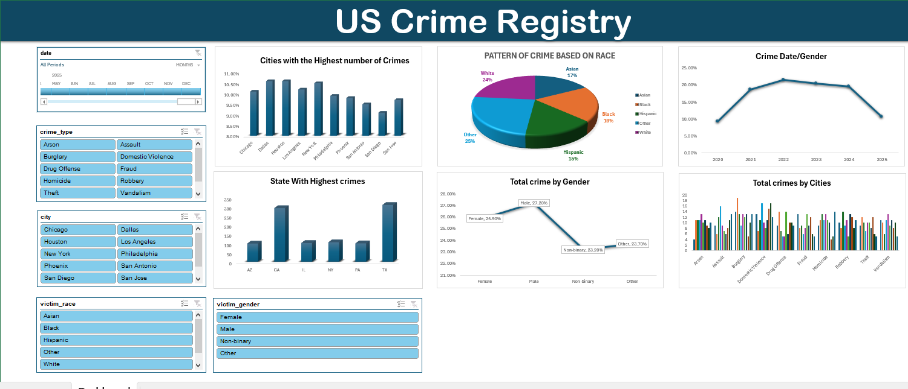
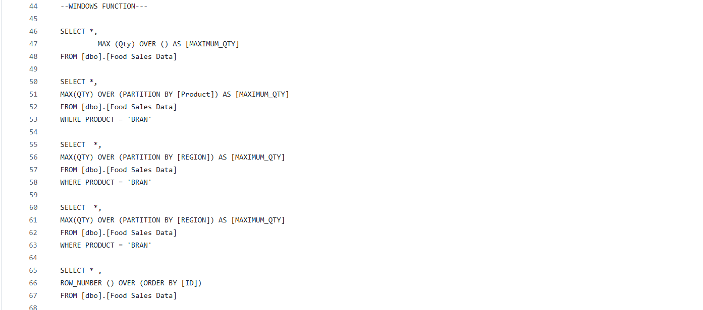

# Data Analytics Portfolio 
# Project 1

**Tittle:** [US Crimes Data analysis](https://github.com/Californiakng/californiakng.github.io/blob/main/crimes%20(version%201).xlsx)

**tools used:** Microsoft Excel (pivot table, pivot chat, power query editor, timelines, slicers, conditional formatting)

**Project Description:** ipsum

**Key findings:**

**Dashboard Overview:**

# Project 2
**tittle:** Customer Insight - Data Manipulation and Interrogation

**SQL Code:** 
[FoodData Insight - sql code](https://github.com/Californiakng/californiakng.github.io/blob/main/FoodData)

**SQL Skills Used:** Database design and normalization (3NF), creation of tables with primary and foreign keys, data integrity enforcement with constraints, data manipulation (INSERT, UPDATE, DELETE), complex data retrieval with JOINs (INNER, LEFT, RIGHT), subqueries and Common Table Expressions (CTEs), aggregation with GROUP BY and HAVING, window functions (ROW\_NUMBER, RANK, DENSE\_RANK), date and time functions for trend analysis, query optimization using indexes, and exporting query results to external files.

**Project Description:** 

**Technology used:** SQL Server
